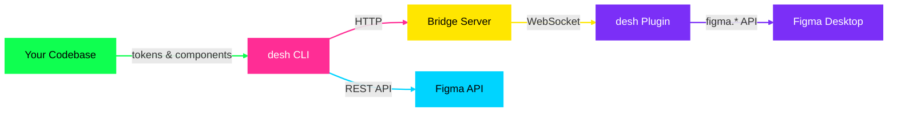
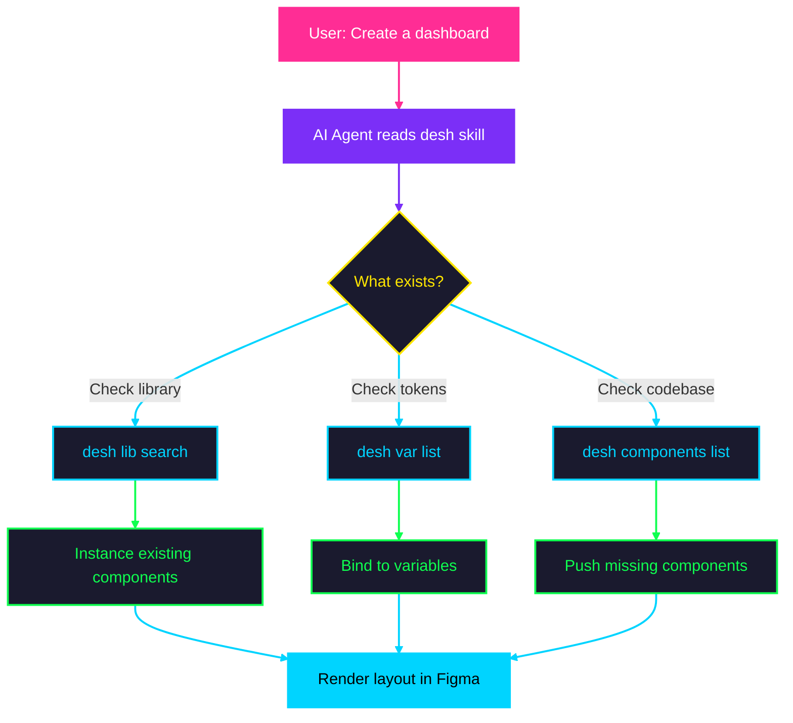

# desh — Design Shell

<p align="center">
  
  
  
  
</p>

<p align="center">
  <b>CLI that bridges your React/Tailwind codebase to Figma Desktop.</b><br>
  Sync tokens, push components, render layouts. No API key needed.
</p>

---

## What is desh?

desh connects to Figma Desktop via a lightweight plugin bridge and gives you full read/write access to your design files — from the command line. No binary patching, no special permissions needed.

- **Codebase-Aware** — reads your Tailwind v4 tokens, shadcn components, and icons from source
- **Plugin Bridge** — a Figma plugin + local WebSocket server, no patching or elevated permissions
- **Design Tokens** — syncs `@theme`, `:root`, `.dark` CSS variables to Figma variables with Light/Dark modes
- **Component Registry** — scans `.tsx` files, pushes components to Figma, instances them in layouts
- **Library Integration** — search and import components from Figma team libraries via REST API
- **JSX Rendering** — create complex Figma layouts from JSX-like syntax with variable binding
- **Analysis** — lint designs, check accessibility (WCAG contrast, touch targets), analyze color/typography usage
- **Export** — PNG, SVG, JSX, CSS variables, Storybook stories

---

## Installation

**Prerequisites:** Node.js 18+ or [Bun](https://bun.sh), Figma Desktop (macOS or Windows)

```bash
npm install -g design-shell
```

That's it. The `desh` command is now available globally.

```bash
# Or with bun
bun add -g design-shell

# Or use npx (no install needed)
npx design-shell connect
```

### From Source

```bash
git clone https://github.com/scanadi/scanadi-desh-cli.git
cd scanadi-desh-cli
bun install && bun run build && bun link
```

---

## Quick Start

```bash
# 1. Start the bridge server
desh connect

# 2. Open Figma → Plugins → desh → Run

# 3. Set up your project (optional — scans codebase, generates config)
desh init

# 4. Sync tokens + components from code to Figma
desh sync

# 5. Create something
desh render '<Frame name="Card" w={320} bg="var:card" rounded={12} flex="col" p={24} gap={12}>
  <Text size={18} weight="bold" color="var:foreground" w="fill">Hello desh</Text>
</Frame>'
```

### First-Time Setup

1. Run `desh connect` — starts a local bridge server
2. Open Figma Desktop and open a design file
3. Go to **Plugins → desh → Run**
4. Run `desh connect` again to verify

The bridge server auto-starts when needed and exits after 5 minutes of inactivity. The desh plugin must be running in Figma for commands to work.

---

## How It Works



desh uses a **plugin bridge** — a Figma plugin communicates with a local WebSocket server. Each command:

1. Sends a request to the bridge server (auto-started)
2. The bridge forwards it to the desh plugin running in Figma
3. The plugin executes via the `figma.*` API and returns the result

No binary patching, no elevated permissions, no re-setup after Figma updates.

For library operations, desh also uses the Figma REST API (requires a personal access token).

---

## Project Configuration

`desh init` scans your project and generates `desh.config.json`:

```json
{
  "tokens": ["packages/ui/globals.css"],
  "primitives": "packages/ui/src/components",
  "components": ["apps/web/src/components"],
  "libraryFileKey": "AHtWZ4s34EqfhXcql7Scsu"
}
```

| Field | Purpose |
|-------|---------|
| `tokens` | CSS files with `@theme`, `:root`, `.dark` blocks (Tailwind v4) |
| `primitives` | Shared UI components directory (shadcn/ui) |
| `components` | App-level component directories |
| `libraryFileKey` | Figma library file key for component search/import (optional) |

Works with monorepos (pnpm, turborepo, nx) and single-app projects. You can also write the config manually.

---

## Design Tokens

desh reads your actual CSS — no hardcoded presets:

```css
@theme {
  --color-primary: oklch(0.205 0 0);
  --radius-md: 0.375rem;
}

:root {
  --background: oklch(1 0 0);
  --primary: oklch(0.205 0 0);
}

.dark {
  --background: oklch(0.145 0 0);
  --primary: oklch(0.985 0 0);
}
```

```bash
desh tokens push    # Creates Figma variables with Light/Dark modes
```

- **Color variables** → "semantic" collection (Light + Dark modes)
- **Float variables** → "primitives" collection (radius, spacing in px)
- **OKLCH, hex, HSL** — all CSS color formats supported

---

## Components

desh scans your `.tsx` files and discovers all exported React components:

```bash
desh components list              # Show all components with variants
desh components push              # Push to Figma as real Components/ComponentSets
```

- **cva() components** (Button, Badge, Toggle) → Figma ComponentSets with variant properties
- **Structural components** (Card, Dialog, Input) → Figma Components with sub-component slots
- **Component registry** (`.desh-registry.json`) → maps component names to Figma node IDs

After pushing, `desh render '<Button variant="destructive">Delete</Button>'` auto-instances from the registry.

---

## Team Libraries

Search and import components from connected Figma libraries via the REST API:

```bash
# Set your Figma API token (add to .env.local)
# FIGMA_API_TOKEN=figd_your_token_here

# Store the library file key
desh lib set-library "AHtWZ4s34EqfhXcql7Scsu"

# Search for components
desh lib search "Button"

# Import all components from a library
desh lib import-all "AHtWZ4s34EqfhXcql7Scsu" --dry-run

# Create an instance by key or name
desh lib instance "Button"
```

Get your API token at https://www.figma.com/developers/api#access-tokens

---

## JSX Rendering

Create complex Figma layouts from JSX-like syntax:

```bash
desh render '<Frame name="Card" w={340} bg="var:card" stroke="var:border" rounded={12} flex="col" p={20} gap={12}>
  <Text size={16} weight="semibold" color="var:foreground" w="fill">Title</Text>
  <Text size={14} color="var:muted-foreground" w="fill">Description text</Text>
  <Frame bg="var:primary" px={16} py={8} rounded={8} flex="row" justify="center">
    <Text color="var:primary-foreground">Button</Text>
  </Frame>
</Frame>'
```

**Tags:** `<Frame>`, `<Text>`, `<Icon>`, `<Slot>`, `<Rectangle>`, `<Ellipse>`, `<Line>`, `<Image>`

**Variable binding:** Any color prop accepts `var:name` to bind to a Figma variable:
```jsx
<Frame bg="var:card" stroke="var:border">
  <Text color="var:foreground">Bound to project tokens</Text>
</Frame>
```

**Icons:** Real SVG vectors from Iconify (150k+ icons):
```jsx
<Icon name="lucide:home" size={20} color="var:foreground" />
```

See [REFERENCE.md](REFERENCE.md) for the full prop reference.

---

## Key Commands

| Command | What it does |
|---------|-------------|
| `desh connect` | Start bridge server, verify plugin connection |
| `desh disconnect` | Stop the bridge server |
| `desh init` | Scan project, generate config |
| `desh sync` | Push tokens + components to Figma |
| `desh tokens push` | Sync CSS variables to Figma |
| `desh components list` | Show discovered components |
| `desh components push` | Push components as Figma Components |
| `desh render '<JSX>'` | Create Figma nodes from JSX |
| `desh eval "expression"` | Run JavaScript in Figma |
| `desh pages list` | List all pages |
| `desh pages switch "name"` | Navigate to a page |
| `desh find "name"` | Find nodes by name |
| `desh node tree` | Show node hierarchy |
| `desh var list` | List Figma variables |
| `desh lib search "query"` | Search library components |
| `desh lib instance "key"` | Create library component instance |
| `desh export node "id" -f png` | Export a node |
| `desh verify "id"` | Screenshot for verification |
| `desh lint` | Lint current page |
| `desh a11y audit` | Full accessibility audit |
| `desh analyze colors` | Analyze color usage |
| `desh text set "id" "content"` | Set text on a node |
| `desh resize "id" 44 44` | Resize a node |

See [REFERENCE.md](REFERENCE.md) for the complete command reference.

---

## Built for AI Agents

desh is designed to be controlled by AI coding agents like **Claude Code**, **Cursor**, and similar tools. Instead of clicking through Figma's UI, tell your AI agent what you want and it drives desh to make it happen.

**Included skill file** — [`skills/desh/SKILL.md`](skills/desh/SKILL.md) teaches any AI agent the full desh workflow:



The skill teaches a **discovery-first workflow** — explore what exists, bridge the gaps, then create. This prevents the common AI mistake of rebuilding components from scratch when they already exist in your design system.

**To use with Claude Code:** Add the skill to your project or point Claude at the `skills/desh/SKILL.md` file. Claude will automatically use desh for any Figma-related task.

---

## Development

```bash
bun install          # Install dependencies
bun run build        # Build (output: dist/cli.js)
bun run dev          # Watch mode — rebuild on changes
bun test             # Run tests
bun run lint         # Type check
```

After `bun link`, any `bun run build` automatically updates the global `desh` command.

---

## Troubleshooting

### Plugin Not Connecting

1. Figma Desktop must be running (not the web version)
2. Open a design file (not the home screen)
3. Run the desh plugin: **Plugins → desh → Run**
4. Run `desh connect`

### Bridge Server Won't Start

The bridge server runs on port 3055 by default. If another process is using it, stop that process or check with `desh connect`.

### Connection Timeout After Heavy Operation

If a large query freezes Figma, quit and reopen Figma. Re-run the desh plugin, then `desh connect`.

---

## Author

**[Stevica Canadi](https://github.com/scanadi)**

## License

AGPL-3.0 — see [LICENSE](LICENSE) for details. Attribution required for all derivative works.
